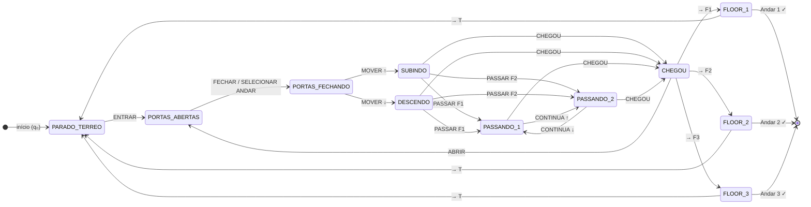

# Meow-Town-AFD-Elevetor

<div align="center">


</div>

<div align="center">

[](https://git.io/typing-svg)

</div>

<br>

<div align="center">


</div>

<br>

---

## 👥 Nossa Equipe

<div align="center">

<sub>Disciplina: <b>Linguagens Formais e Autômatos</b> — Universidade São Judas Tadeu · 2026</sub>

<br><br>

<table>
  <tr>
    <td align="center" width="14%">
      <a href="https://github.com/atr3ssa">
        <br>
        <sub><b>Andressa Rabêlo</b></sub>
      </a><br>
      <sub>RA: 823213904</sub>
    </td>
    <td align="center" width="14%">
      <a href="https://github.com/Julia-Olive">
        <br>
        <sub><b>Júlia Oliveira</b></sub>
      </a><br>
      <sub>RA: 823214680</sub>
    </td>
    <td align="center" width="14%">
      <a href="https://github.com/Marzocca99">
        <br>
        <sub><b>Lucas Marzocca</b></sub>
      </a><br>
      <sub>RA: 823116813</sub>
    </td>
    <td align="center" width="14%">
      <a href="https://github.com/Elmarquitoos">
        <br>
        <sub><b>Marcos V. Santos</b></sub>
      </a><br>
      <sub>RA: 82327399</sub>
    </td>
    <td align="center" width="14%">
      <a href="https://github.com/matheushfg">
        <br>
        <sub><b>Matheus H. F.</b></sub>
      </a><br>
      <sub>RA: 823141914</sub>
    </td>
    <td align="center" width="14%">
      <a href="https://github.com/b3ery">
        <br>
        <sub><b>Mylena Soares</b></sub>
      </a><br>
      <sub>RA: 824144075</sub>
    </td>
  </tr>
</table>

</div>

<br>

---

## 🌃 Sobre o Projeto

> **Meow Tower** é uma animação interativa de um **hotel pixel art**, desenvolvida como trabalho prático da disciplina de **Linguagens Formais e Autômatos**. O sistema implementa um **Autômato Finito Determinístico (AFD)** completo para controlar o elevador do hotel — com estados, transições, alfabeto de entrada e estados de aceite — em uma interface web com estética **lo-fi noturna roxa**. Explore o lobby, o restaurante, a academia e os apartamentos! 🐱💜

<br>

<div align="center">

```
╔═══════════════════════════════════════════════════════════════════╗
║  🏢 Lobby/Terreo  →  🛎️ Entra no Elevador  →  🔢 Escolhe Andar  ║
║        ↓                                            ↓             ║
║  🚪 Sai no Andar  ←   📍 Chegou ao Destino  ←  🔄 Subindo/Desc  ║
╚═══════════════════════════════════════════════════════════════════╝
```

</div>

<br>

---

## 🧠 Fundamentação Teórica — O AFD

O sistema do elevador é modelado formalmente como:

$$M = (Q,\ \Sigma,\ \delta,\ q_0,\ F)$$

| Componente | Símbolo | Implementação no projeto |
|:---:|:---:|:---|
| **Estados** | $Q$ | `PARADO_TERREO`, `PORTAS_ABERTAS`, `PORTAS_FECHANDO`, `SUBINDO`, `DESCENDO`, `PASSANDO_1`, `PASSANDO_2`, `CHEGOU`, `FLOOR_1`, `FLOOR_2`, `FLOOR_3` |
| **Alfabeto** | $\Sigma$ | Botões T, 1, 2, 3 · Abrir porta · Fechar porta · Entrar · Chegada |
| **Transição** | $\delta$ | `δ(PARADO_TERREO, ENTRAR) → PORTAS_ABERTAS` · `δ(PORTAS_FECHANDO, SUBIR) → SUBINDO` |
| **Estado Inicial** | $q_0$ | `PARADO_TERREO` — elevador em repouso no térreo |
| **Estados Finais** | $F$ | `FLOOR_1`, `FLOOR_2`, `FLOOR_3` — elevador chegou ao andar destino |

<br>

### Tabela de Transições δ

<div align="center">

| Estado Atual | Evento | Próximo Estado |
|:---:|:---:|:---:|
| `PARADO_TERREO` | Entrar no elevador | `PORTAS_ABERTAS` |
| `PORTAS_ABERTAS` | Selecionar andar / Fechar | `PORTAS_FECHANDO` |
| `PORTAS_FECHANDO` | Destino acima | `SUBINDO` |
| `PORTAS_FECHANDO` | Destino abaixo | `DESCENDO` |
| `SUBINDO` | Passar pelo andar 1 | `PASSANDO_1` |
| `SUBINDO` | Passar pelo andar 2 | `PASSANDO_2` |
| `PASSANDO_1` | Continuar subindo | `PASSANDO_2` |
| `PASSANDO_2` | Continuar descendo | `PASSANDO_1` |
| `SUBINDO` / `DESCENDO` / `PASSANDO_*` | Chegou ao destino | `CHEGOU` |
| `CHEGOU` | Abrir portas | `PORTAS_ABERTAS` |
| `CHEGOU` | Entrar no andar 1 | `FLOOR_1` ✓ |
| `CHEGOU` | Entrar no andar 2 | `FLOOR_2` ✓ |
| `CHEGOU` | Entrar no andar 3 | `FLOOR_3` ✓ |
| `FLOOR_*` | Chamar elevador | `PARADO_TERREO` |

</div>

> Os estados `PASSANDO_1` e `PASSANDO_2` são registrados automaticamente durante o deslocamento, garantindo o rastreio completo das transições intermediárias no relatório AFD.

<br>

### 📊 Diagrama de Estados



<br>

---

## 🏨 Andares e Funcionalidades

<div align="center">

| Andar | Nome | O que explorar |
|:---:|:---:|:---|
| **T** | 🏢 Térreo / Lobby | Meow Candy (loja de doces), Stand de café, Recepção |
| **1** | 🍽️ Restaurante | Cardápio completo, Bar com drinks, Banheiro, Garçom animado |
| **2** | 💪 Academia | 9 equipamentos, Bebedouro, Vestiário, Piscina com ondas animadas, Terraço |
| **3** | 🛋️ Apartamentos | Corredor 301/302/303 · Apt 302 explorável: sacada, sala, cozinha, jantar, quarto, banheiro |

</div>

<br>

---

## ⚙️ Funcionalidades do Sistema

<div align="center">

| Feature | Descrição |
|:---:|:---|
| 🛗 **Elevador animado** | Tela de viagem com labels de andares se movendo, sacudida e sons de chegada |
| 📺 **HUD de estado** | Exibe o estado AFD atual do elevador em tempo real com transições |
| 🎮 **Personagens jogáveis** | Escolha entre 3 personagens (Helo, Pedro, Apollo) com sprites animados |
| 🚶 **Movimentação livre** | Ande pelos andares com ← → ou A/D, câmera segue o personagem |
| 🍬 **Stand de Café** | Pegue café, suco ou sanduíche e consuma clicando no personagem |
| 🍽️ **Garçom interativo** | Escolha do cardápio → garçom aparece na porta → vá buscar o pedido |
| 💪 **Academia completa** | Treine em cada equipamento, tome banho, use vestiário, nade na piscina |
| 🏠 **Apartamento 302** | Explore todos os cômodos: balancê na sacada, cozinhe, durma, tome banho |
| 🎵 **Sons sintéticos** | Web Audio API — sons de elevador, compra, interações e chegada de andar |
| 📋 **Relatório AFD** | Ao abrir o relatório, exibe o **diagrama completo** e a **timeline de transições** δ percorridas na sessão |

</div>

<br>

---

## 🚀 Como Executar

**💻 Local:**
```bash
git clone https://github.com/b3ery/MeowTower.git
cd MeowTower
# Abra o index.html no navegador
```

**Controles:**
```
← →  ou  A D    Mover personagem
   E            Interagir / Usar elevador
   W            Sair do elevador
  ESC           Fechar modais
```

> Sem dependências externas. HTML5 + CSS3 + JavaScript puro. ✨

<br>

---

<div align="center">

<br>


</div>
